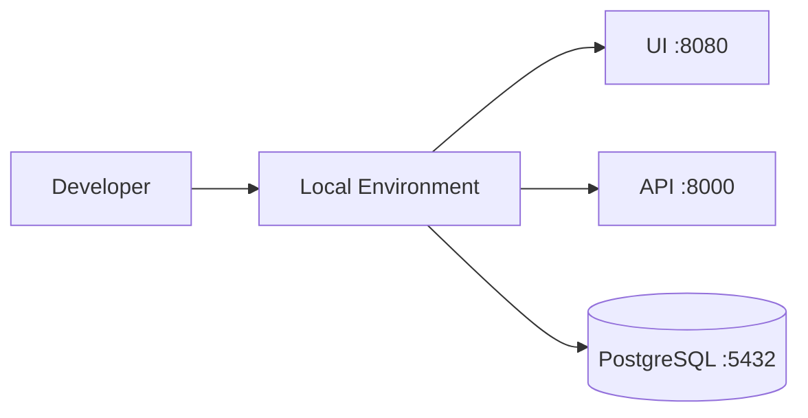
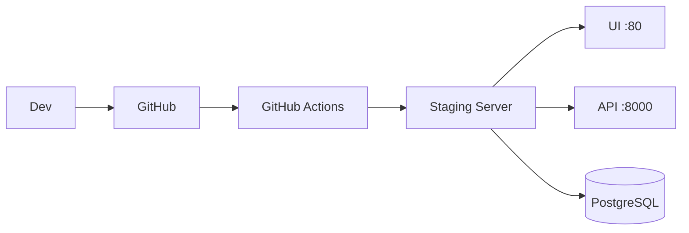
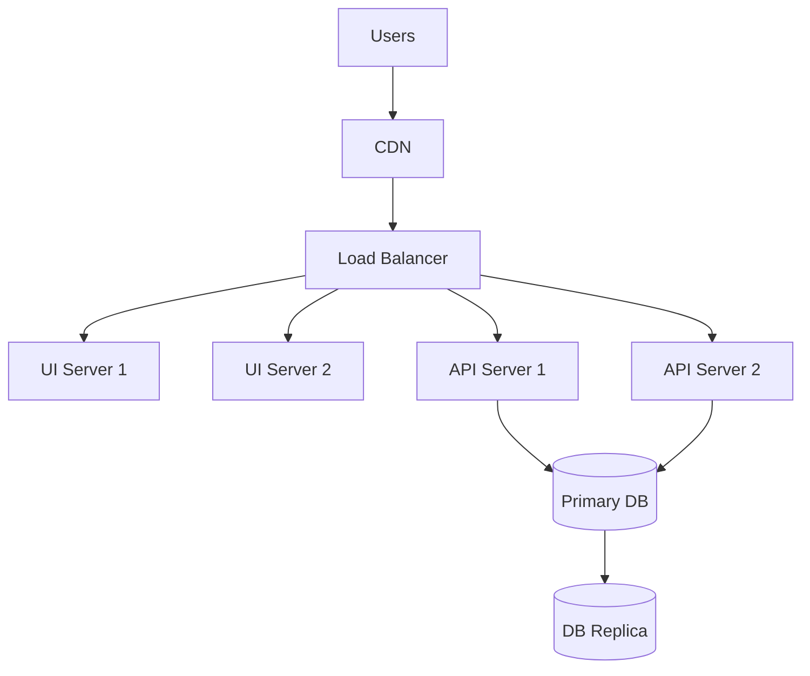
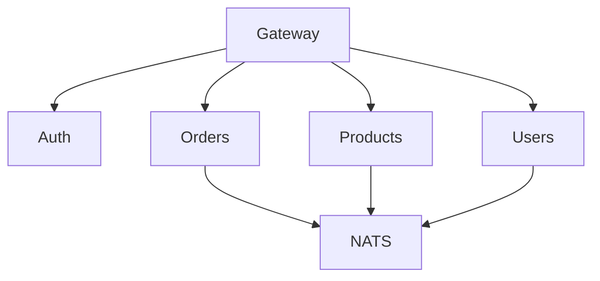
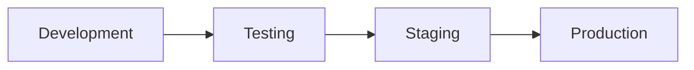

# Deployment Scenarios

## Local Development


### Setup
```bash
# Start local environment
make dev

# Start with hot reload
make watch
```

## Staging Environment


### Configuration
```yaml
# staging.yml
environment:
  name: staging
  domain: staging.zibelina.com
  ssl: true
  monitoring: basic
```

## Production Environment


### High Availability Setup
```yaml
# docker-compose.prod.yml
services:
  api:
    deploy:
      replicas: 2
      update_config:
        order: start-first
        failure_action: rollback
      restart_policy:
        condition: any
```

## Microservices Architecture


### Service Mesh Configuration
```yaml
# istio-config.yml
apiVersion: networking.istio.io/v1alpha3
kind: VirtualService
metadata:
  name: zibelina-routing
spec:
  hosts:
  - "*.zibelina.com"
  http:
  - match:
    - uri:
        prefix: /api/auth
    route:
    - destination:
        host: auth-service
```

## Cloud Deployment

### AWS Setup
```terraform
# main.tf
provider "aws" {
  region = "us-west-2"
}

module "zibelina" {
  source = "./modules/zibelina"
  environment = "production"
  domain = "zibelina.com"
}
```

### Digital Ocean Setup
```terraform
# digitalocean.tf
resource "digitalocean_kubernetes_cluster" "zibelina" {
  name    = "zibelina-cluster"
  region  = "nyc1"
  version = "1.24.4-do.0"
  
  node_pool {
    name       = "worker-pool"
    size       = "s-2vcpu-4gb"
    node_count = 3
  }
}
```

## Bare Metal Deployment

### Server Setup
```bash
# Install requirements
apt update && apt install -y \
    docker.io \
    docker-compose \
    nginx \
    certbot

# Setup certificates
certbot --nginx -d zibelina.com
```

### Monitoring Setup
```yaml
# prometheus.yml
global:
  scrape_interval: 15s

scrape_configs:
  - job_name: 'zibelina'
    static_configs:
      - targets: ['localhost:9090']
```

## Development Pipeline


### Deployment Checks
```bash
# Pre-deployment checks
make check-security
make check-performance
make check-dependencies

# Post-deployment checks
make verify-deployment
make monitor-errors
```

## Rollback Procedures

### Quick Rollback
```bash
# Rollback to previous version
make rollback

# Verify rollback
make health-check
```

### Database Rollback
```bash
# Revert last migration
diesel migration revert

# Restore from backup
make db-restore backup=backup_20240118.sql
```