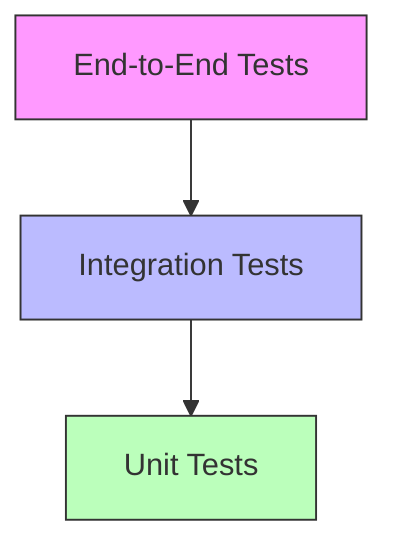

# Testing Strategy

## Test Pyramid



## Unit Testing

### Backend Tests
```rust
#[cfg(test)]
mod tests {
    use super::*;

    #[test]
    fn test_order_total_calculation() {
        let order = Order {
            items: vec![
                OrderItem { price: 100, quantity: 2 },
                OrderItem { price: 50, quantity: 1 }
            ]
        };
        
        assert_eq!(order.calculate_total(), 250);
    }
}
```

### Frontend Tests
```rust
#[cfg(test)]
mod tests {
    use wasm_bindgen_test::*;
    use yew::App;

    wasm_bindgen_test_configure!(run_in_browser);

    #[wasm_bindgen_test]
    fn test_button_click() {
        let app = App::<Counter>::new();
        let button = app.get_by_text("Increment");
        button.click();
        assert_eq!(app.get_by_text("Count: 1").exists(), true);
    }
}
```

## Integration Testing

### API Integration Tests
```rust
#[tokio::test]
async fn test_order_creation_flow() {
    let app = test::init_service(App::new()).await;
    
    // Create user
    let user = create_test_user(&app).await;
    
    // Create order
    let order = json!({
        "items": [{"product_id": 1, "quantity": 2}]
    });
    
    let resp = test::TestRequest::post()
        .uri("/api/orders")
        .set_json(&order)
        .send_request(&app)
        .await;
        
    assert!(resp.status().is_success());
}
```

### Database Integration Tests
```rust
#[tokio::test]
async fn test_database_transactions() {
    let pool = test_db_pool().await;
    let mut tx = pool.begin().await?;
    
    // Test transaction
    let result = create_order(&mut tx).await;
    assert!(result.is_ok());
    
    tx.rollback().await?;
}
```

## End-to-End Testing

### Playwright Tests
```typescript
test('complete checkout flow', async ({ page }) => {
    await page.goto('/');
    
    // Add item to cart
    await page.click('[data-testid="add-to-cart"]');
    
    // Go to checkout
    await page.click('[data-testid="checkout"]');
    
    // Fill shipping info
    await page.fill('#name', 'Test User');
    await page.fill('#email', 'test@example.com');
    
    // Complete order
    await page.click('#submit-order');
    
    // Verify success
    expect(await page.textContent('.order-confirmation'))
        .toContain('Order successful');
});
```

## Performance Testing

### Load Testing
```bash
# Using k6 for load testing
k6 run performance/load_test.js
```

### Benchmark Tests
```rust
#[bench]
fn bench_order_processing(b: &mut Bencher) {
    b.iter(|| {
        let order = create_test_order();
        process_order(order)
    });
}
```

## Test Automation

### GitHub Actions
```yaml
test:
  runs-on: ubuntu-latest
  steps:
    - uses: actions/checkout@v3
    
    - name: Run Tests
      run: |
        make test
        make test-integration
        make test-e2e
```

## Test Data Management

### Factories
```rust
// Test data factory
pub struct UserFactory {
    pub name: String,
    pub email: String,
}

impl UserFactory {
    pub fn new() -> Self {
        Self {
            name: "Test User".to_string(),
            email: "test@example.com".to_string(),
        }
    }
    
    pub fn create(&self) -> User {
        // Create user in test database
    }
}
```

### Fixtures
```rust
// Test fixtures
#[fixture]
fn test_products() -> Vec<Product> {
    vec![
        Product { name: "Test Product 1", price: 100 },
        Product { name: "Test Product 2", price: 200 },
    ]
}
```

## Test Coverage

```bash
# Generate coverage report
cargo tarpaulin --out Html
```

## Monitoring Test Quality

- Test coverage trends
- Test execution time
- Flaky test detection
- Test maintainability metrics